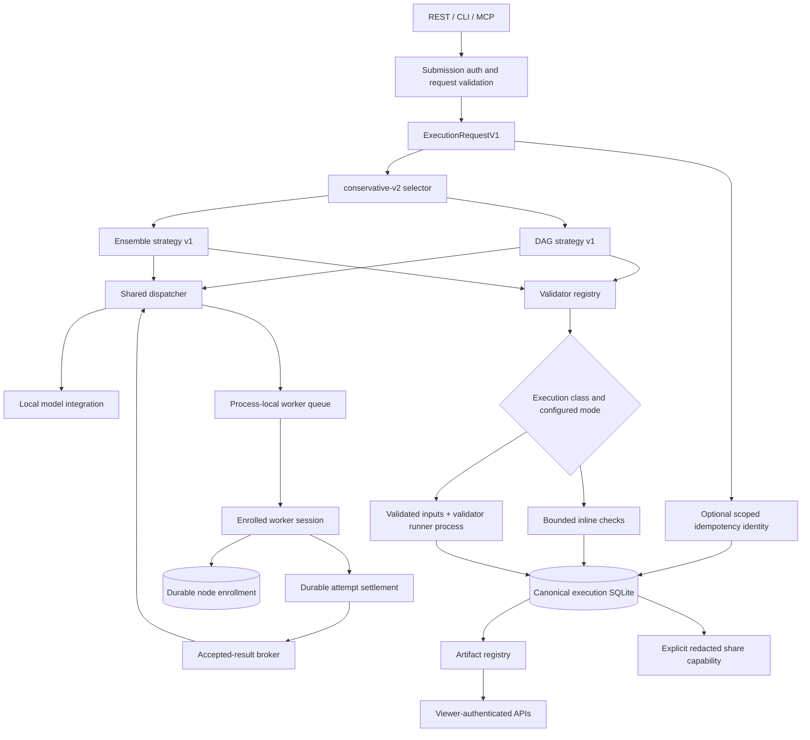
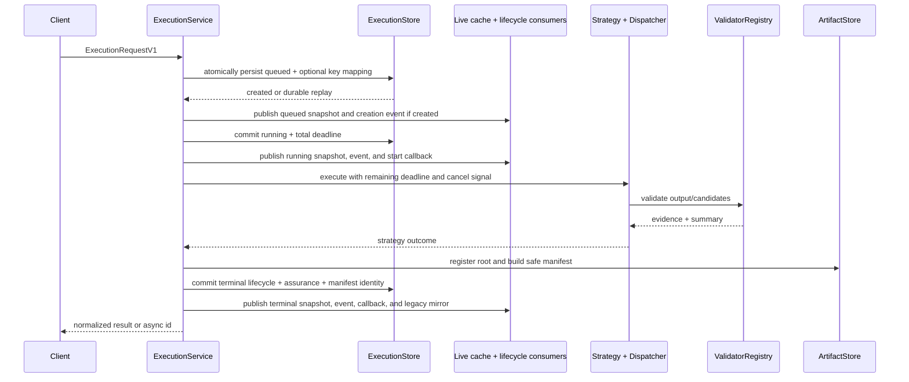
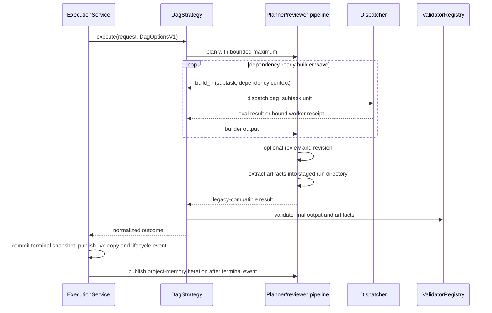
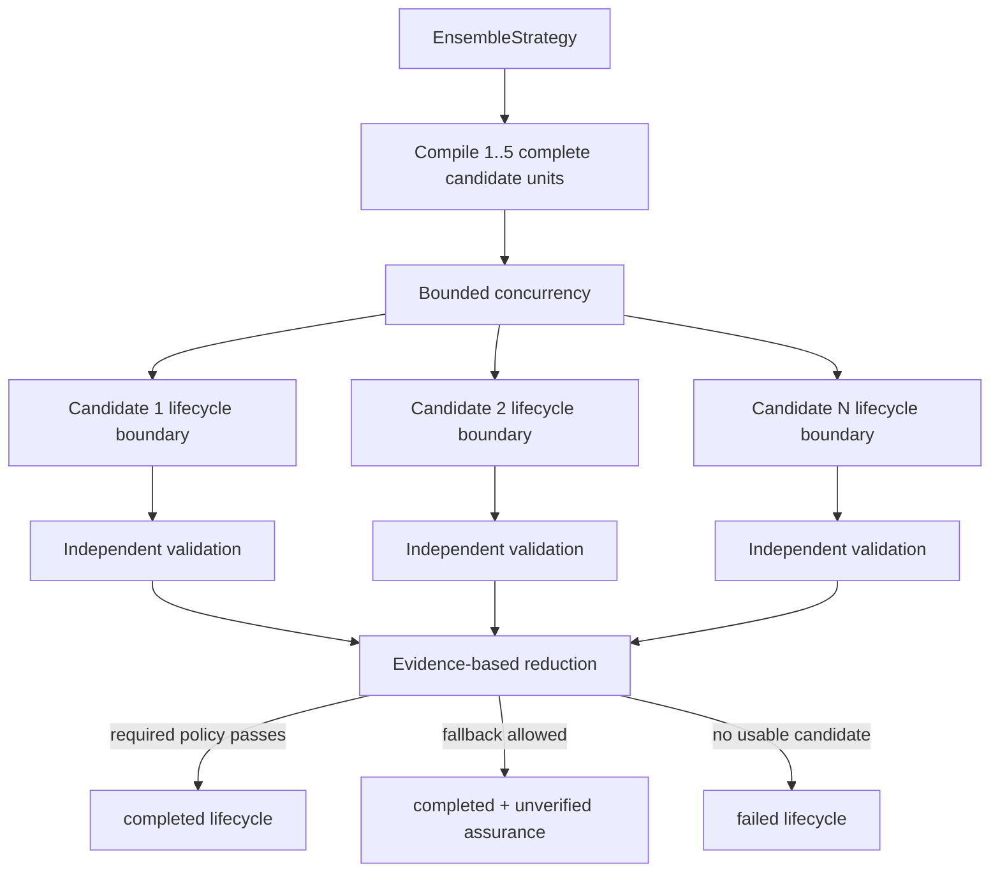
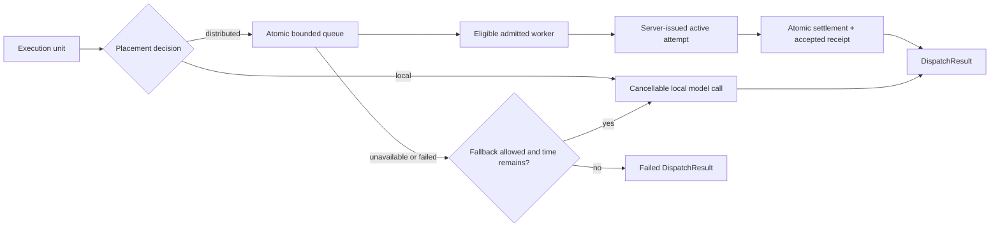
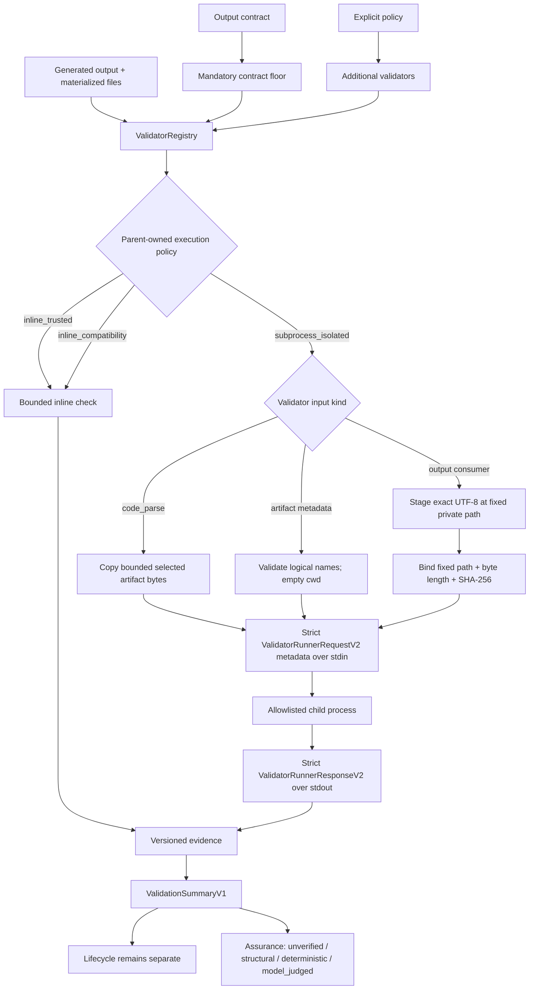
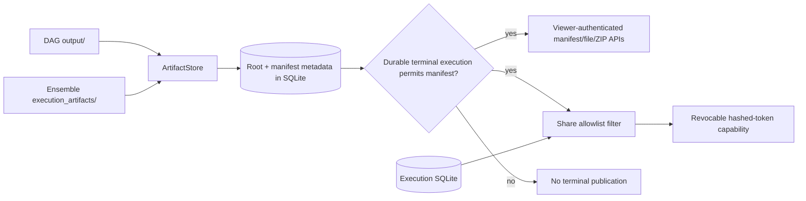
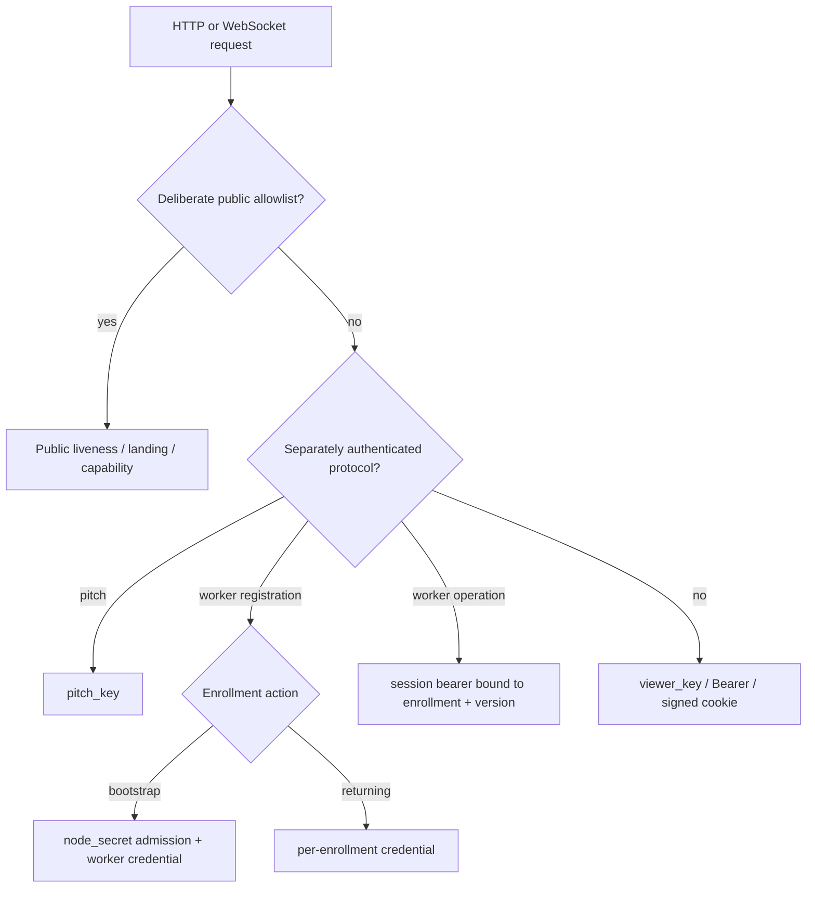

# Trusted-Alpha Execution Architecture

Mycelium separates request policy, orchestration strategy, placement, attempt
authority, validation, artifact delivery, and read access. REST, CLI, MCP, and
legacy adapters converge on the canonical execution service; no route-specific
worker result path may bypass durable attempt settlement.

## System map



`direct` has no strategy class: it is recorded as requested and runs ensemble
with one candidate. `auto` is a deterministic policy. Adding another strategy
would require a contract, registry entry, strategy adapter, validation policy,
persistence coverage, and measured acceptance criteria; no additional strategy
is part of the trusted-alpha sprint.

## Canonical control flow



The total deadline starts at queueing, not at the first worker poll. Each stage
receives only the remaining budget. The execution service owns terminal-state
projection and persistence; strategies cannot turn validation confidence into a
lifecycle state. Every authoritative snapshot is committed before its deep live
copy, normal lifecycle event, callback, compatibility mirror, response, or
terminal artifact/share publication. Diagnostic publication failure is not a
lifecycle transition. See [ADR 0009](adr/0009-durable-terminal-commit-before-publication.md).

## Idempotent canonical submission

Only canonical HTTP submission currently accepts `Idempotency-Key`. After
authentication, rate limiting, and canonical validation, the endpoint computes
three digests: the explicitly versioned canonical request, the key, and its
requester scope. Pre-capability requests retain serializer version 1; an
effective typed resource constraint selects version 2, and the durable mapping
records which serializer replay must use. Configured `pitch_key` material
defines the authenticated
scope; open development mode uses the direct ASGI peer host as a best-effort
scope and does not trust forwarding headers.

An immediate SQLite transaction either creates the initial queued execution
and mapping together, returns the existing execution for a matching replay, or
reports a conflict for a different request. Process-local controls and work are
created only for the committed create outcome. Replaying a queued, running, or
terminal execution never schedules it again.

Idempotency preserves one execution identity; it does not resume process-local
work. A queued commit whose scheduler task is lost at restart becomes
`interrupted`, and the same key continues to return that execution. See
[ADR 0008](adr/0008-idempotent-canonical-execution-submission.md).

## Contributor enrollment and incarnation

Worker trust uses four deliberately separate identifiers. `enrollment_id` is
the immutable durable identity of one invited contributor; `node_id` is its
human-readable label; `session_id` identifies one live worker process; and
`attempt_id` authorizes one lease. The deployment-wide `node_secret` is used
only to admit an initial bootstrap. A returning worker proves its per-node
enrollment credential and receives a new process-local session without the
shared secret.

The coordinator stores a domain-separated digest of each enrollment credential
and no plaintext. Sessions retain only their own token digest plus the
enrollment, label, and credential-version binding. Every authenticated worker
operation checks durable active status. Revocation or rotation therefore
invalidates live use without making sessions durable. Restart drops all
sessions and active scheduling state but preserves enrollment identity and
historical attribution. See
[ADR 0010](adr/0010-durable-enrollment-identity.md).

## Capability claims and hard eligibility

Each enrolled worker session may bind one strict versioned capability
descriptor. It describes the node's claimed executor, models, hardware,
features, limits, and isolation. Canonical JSON and its SHA-256 digest are
stored as an immutable enrollment-scoped snapshot; changing a claim requires a
new session. Values populated by stock-worker detection or operator overrides
remain self-reported claims, not observed evidence or attestation. The digest
identifies the claim; it does not prove the claimed hardware or model bytes.

The descriptor's `limits.max_output_bytes` is a hard claimed placement limit.
The canonical execution supplies the authoritative output budget as bounded
server matching context: a typed node is eligible only when its claimed maximum
is greater than or equal to the task budget. A lower claim yields
`insufficient_output_capacity`. The execution budget is not duplicated in the
typed resource-requirement model or its hashes. Descriptorless local
compatibility sessions retain their explicit legacy behavior because the server
does not invent a typed capacity claim for them.

`limits.max_concurrent_execution_units` is an informational claimed upper
bound. The coordinator does not maintain or enforce per-node slot counts and
does not turn values above one into parallel server slots. The stock worker
polls and executes sequentially, conservatively staying within the claim;
worker concurrency and capacity-weighted scheduling are not part of this
architecture.

Canonical requests may carry bounded typed resource requirements in addition
to legacy required-capability strings. A single pure matcher is used for
initial node qualification, eligible-set construction, worker polling, the
under-lock final handout recheck, protected diagnostics, and shadow candidate
capture. It returns stable exclusion reasons and the descriptor hash evaluated.
Hard constraints exclude ineligible nodes but never rank eligible ones, and
unknown claim values do not satisfy exact or minimum constraints.

Hard eligibility is the complete production scheduling policy. The optional
sampled-comparison path records bounded output-shape agreement, but agreement is
not correctness or trust and never delays, ranks, or reorders production work.
The circuit breaker remains the only failure-based exclusion mechanism.

Attempt issuance binds the session's descriptor version/hash and the canonical
requirement version/digest before handout. Receipts preserve that binding, so a
later session's descriptor cannot change historical assignment meaning. See
[ADR 0011](adr/0011-node-capabilities-versioned-claims.md).

The same durable attempt stores the exact server-issued output limit. A larger
descriptor claim cannot raise it, and worker streaming or result submission
cannot renegotiate it. Stream and settlement enforcement continue to use the
attempt value.

## Scoped capability evidence and shadow policy

The coordinator records bounded operational observations for accepted worker
attempts. A scope is the exact enrollment, descriptor version/hash, executor
kind/version/protocol, selected model provider/name/digest/variant, task class,
and evidence role (`production` or `sampled_comparison`). Missing or inconsistent
bindings are excluded rather than inferred. A descriptor, selected model, task
class, or role change therefore starts a cold scope instead of inheriting an old
history.

Recorded observations are accepted settlement outcome, non-empty output settled
before the issued lease deadline, coordinator wall time, output byte count and
effective throughput, candidate-local contract-floor outcome when that check ran
to a terminal result, worker-attributable lease expiry or stale-node disconnect,
and paired sampled shape agreement. A timely worker error or empty output is a
deadline failure. Fault attribution uses the server-owned terminal cause. Caller
cancellation, execution deadline, coordinator restart, session replacement,
enrollment reclaim, receipt-binding failure, payload/stream limits, supersession,
and unknown causes are not charged to a worker scope.
Sampled attempts durably bind the exact production attempt they compare.

`capability_evidence_mode` accepts only `off` or `shadow` and defaults to `off`.
Both modes preserve the same production handout. `shadow` evaluates a bounded
counterfactual only after the real attempt is durable and assigned. Admission
freezes bounded, non-secret node claim inputs at assignment time; canonical
rematching and descriptor/model scope construction consume that immutable
snapshot in background work outside the production queue lock. Handout does not
wait for scope matching, capture, or evidence aggregation. The evaluator uses
only the resulting scopes plus observations recorded no later than assignment.
Below `capability_evidence_min_samples` (default 5), a scope is
explicitly insufficient rather than bad. Binary aggregates expose counts, rates,
and Wilson intervals; recent latency and throughput use bounded medians. Sampled
agreement is diagnostic output-shape agreement, not semantic correctness, and
is not a shadow preference dimension.

Observations and shadow decisions are append-only in SQLite. Observations remain
in authoritative `events.db`; optional decisions use sibling
`capability-shadow-health.db`, and legacy decision rows copy forward
idempotently. Domain-separated deterministic IDs make exact replay idempotent
and conflicting reuse an error.
Evidence recording is contained by a savepoint or best-effort boundary: its
failure cannot reverse accepted settlement, receipt publication, or contribution
credit. Missing-only attempt reconciliation and append-only contract-floor
projection receipts provide bounded startup repair without completed rows
starving later gaps. Deadline-success semantics use a versioned subject key, so
an upgrade backfills corrected evidence without mutating or double-counting
superseded append-only rows.

Shadow-pipeline operational health is a separate bounded record alongside the
isolated decisions in
`capability_shadow_operational_events`, stored in the sibling
`capability-shadow-health.db` rather than authoritative `events.db`. Admission
is classified as `disabled`,
`not_applicable`, `queue_saturated`, `scope_capture_failed`, or `scheduled`;
scheduled evaluation terminates as
`completed`, `evaluator_failed`, `decision_write_failed`, or
`cancelled_on_shutdown`. Durable records contain only deterministic event and
attempt IDs, phase, outcome, bounded reason code, and occurrence time.
The separate database keeps best-effort health writes out of authoritative
attempt, assignment, and settlement writer locks. Store-write, containment,
and callback failures that cannot safely self-record
are process-lifetime counters with a reset timestamp. Operational accounting is
best effort and cannot change or delay production placement or settlement.
If an evaluation row persists after its admission row failed to persist, the
protected aggregate exposes it in `orphan_evaluation_total` and treats it as one
inferred scheduled/offered observation. This keeps the terminal outcome visible
and makes the reported failure numerator and offered denominator reproducible.
Graceful shutdown closes admission and drains capture/decision work for a finite
interval. Timed-out capture is an operational scope-capture failure; an
in-flight decision write retains its truthful eventual commit/failure outcome.
Background evidence aggregation uses a schema-initialized, query-only SQLite
connection, so abandoned optional work cannot mutate authoritative `events.db`.

Each scope also carries a derived future-active identity diagnostic. Its bounded
blockers are `legacy_descriptor_identity`,
`descriptor_identity_unreconstructable`, `immutable_model_identity_missing`,
and `model_identity_unreconstructable`. The diagnostic does not change hard
eligibility or itself suppress shadow collection; digestless typed scopes still
collect when the existing evidence resolver can otherwise reconstruct them.
Passing the identity prerequisite is not trust, correctness, reputation,
attestation, or authorization to route actively.

Viewer-protected `GET /v1/operator/capability-evidence` returns aggregates and
shadow decision counts, future-active identity blockers, and shadow operational
health, never raw observations or operational events. The report exposes counts
and the explicit drop/failure numerator and denominator, not only a percentage,
and distinguishes durable history from process-local fallback counters. Evidence
and health rows contain no prompt, output body, worker error text, free-form
reason, credential, nonce, session secret, artifact content, or arbitrary
telemetry. Contribution points remain a separate record of accepted compute;
they are not capability evidence, assurance, correctness, reputation, or routing
weight. Active evidence routing remains unimplemented. See
[ADR 0012](adr/0012-observed-capability-evidence-shadow-only.md).

## Durable verification evidence

```text
terminal execution  --referenced by-->  verification_evidence  (append-only)
        ^                                        |
        |                                        v
   never written back                   protected operator read
```

Post-hoc verification produces evidence *about* an execution that is already
terminal. The arrow only points one way: evidence names an execution, attempt,
and receipt, and nothing in the evidence path can write to them. There is no
foreign key back into terminal state, so evidence cannot block or cascade into it
either, and update/delete are refused by triggers.

The scope is the same shape as scoped capability evidence, plus verifier
kind/name/version. Deterministic checks and agreement observations are different
kinds with disjoint outcome vocabularies and separate scopes, so no aggregate can
turn agreement into a pass rate. Writes are best-effort with process-local
fallback counters, on the Theme 2.1 pattern.

Nothing consumes this yet. It exists so that a task-class assurance ladder
(Theme 3B-2) can be built on durable, replay-safe, attribution-aware data rather
than on a process-local dictionary. See
[ADR 0014](adr/0014-durable-verification-evidence.md).

## DAG execution



Planning, review, and revision are coordinator work. Builder units may be local
or distributed. The existing pipeline remains an adapter behind the canonical
service rather than being copied into routes. Project memory is a downstream
compatibility publication: a failed terminal commit leaves the staged run and
project iteration unpublished.

## Ensemble execution



Generation, candidate directory creation, materialization, extraction, and
validation are inside each candidate's error boundary. `validated_score` orders
accepted candidates by assurance, validator score, lower latency, and stable id.
`first_valid` uses completion order. Neither policy uses output length as a
quality signal.

Project memory is intentionally rejected for ensemble/direct until a
selected-result-only update design exists. DAG remains the supported project
path.

## Placement-independent dispatch



Strategy and placement are orthogonal: complete ensemble candidates as well as
DAG builder units may run on workers. `local_only` prohibits worker dispatch.
Typed resource requirements, legacy capability tags, approved-node allowlists,
and breaker state filter eligibility. Typed and legacy constraints are both
hard when both are present and use the same matcher again at task handout.
Canonical remote-capable requests require a recorded consent bit.

Results distinguish placement requested, planned, and observed. Unit counts,
fallback count, attempt count, reassignments, and retries prevent a mixed or
reclaimed run from being summarized as one clean remote attempt.

## Attempt authority and accepted-result broker

```mermaid
sequenceDiagram
    participant D as Dispatcher
    participant Q as Process-local queue
    participant W as Worker
    participant A as AttemptStore SQLite
    participant B as AcceptedResultBroker
    D->>Q: queue bound execution unit
    W->>Q: poll as admitted node
    Q->>A: insert attempt + descriptor/requirement digests before handout
    Q-->>W: task + attempt id + nonce + lease + immutable bindings
    W->>A: submit echoed binding fields and output
    A->>A: BEGIN IMMEDIATE; validate; active→settled
    A->>A: insert receipt + unique compute contribution
    A-->>B: publish immutable accepted receipt
    B-->>D: receipt matching execution/unit/kind/version
```

The SQLite attempt row is authoritative. The worker cannot select legacy
validation by omitting its contract version or binding fields. Only an active,
unexpired, matching attempt can settle. Raw nonces are never persisted; their
SHA-256 digests are.

Exact replay returns the durable response after restart. Changed replay and
inactive or mismatched attempts are rejected. Rejected output may enter the
bounded quarantine, which is separate from accepted receipts and cannot satisfy
a dispatcher wait, update normal success statistics, or earn points.

The in-memory `task_results` map is a compatibility mirror populated after
settlement. It is not authority.

## Validation and assurance



Contract floors always use AND semantics and cannot be weakened by explicit
validators. `require_all` affects only explicit required validators. Structural
checks report structure; JSON Schema reports deterministic contract
conformance. Current validators do not prove general behavioral correctness.

In `auto`, the registry classifies `code_parse`, `structured_json`, and
`json_schema` as `subprocess_isolated`. `nonempty`, `artifact_extraction`,
`artifact_contract`, and `file_manifest` are `inline_trusted`. Forced
`subprocess` supports every current built-in; explicit `inline` is a weaker
local-development mode and trusted-alpha preflight rejects it. Evidence records
`inline_compatibility` when that setting overrides an isolated parser, rather
than relabeling it `inline_trusted`. The registry is a closed allowlist and
cannot load an import path, command, callable, or plugin.

New parent calls send only a V2, size-bounded, validator-specific JSON control
request on stdin and accept one strict bounded V2 response on stdout. The
control envelope never contains the generated output body. For `nonempty`,
`structured_json`, and `json_schema`, the parent instead stages the exact
strict UTF-8 bytes at the fixed reserved path
`__mycelium_validator_input__/output.utf8` and binds that path, encoding, byte
length, and lowercase SHA-256 in the request. The canonical
`ExecutionRequestV1.max_output_bytes` remains authoritative up to 10 MiB;
the default 2 MiB `validator_subprocess_request_max_bytes` limits only control
metadata. Identity and version
must match, unknown fields fail closed, and the parent—not the child—supplies
required/optional source, assurance, behavioral-correctness, execution-mode,
containment, and applicable termination metadata. Bounded child detail remains
non-authoritative. Spawn failure, timeout, crash, malformed or oversized
response, output-reference failure, and staging error become bounded error
evidence. V1 remains explicitly parseable for compatibility tests, but new
parent calls do not emit it; a malformed or failed V2 exchange is never
reinterpreted, retried as V1, or run inline. An unconfirmed
process-tree cleanup is reflected in error evidence or the content-free cleanup
counter, depending on the original outcome; an isolated validator never falls
back inline.

The output namespace is parent-owned and ephemeral. Candidate artifact paths
cannot occupy it. The parent creates the file exclusively with private modes
where supported, hashes the exact bytes, closes it before spawn, and checks
cancellation/deadline state during staging. The child accepts no alternate
path, rejects links/reparse points and nonregular targets, opens the file once,
and verifies confinement, descriptor identity, exact size, digest, and strict
UTF-8 before dispatching the string to the allowlisted validator. Stable
content-free failures and process counters expose reference integrity and
staging health without publishing the output, digest, private path, schema, or
raw exception.

`code_parse` receives bounded regular-file copies from the authoritative
candidate subtree in a fresh private directory. File count, per-file and
aggregate size, and relative-path length are bounded; traversal, symlinks,
special files, snapshot changes, and another candidate's files are excluded.
Destinations are fresh byte copies rather than hard links. When forced through
the subprocess, `artifact_extraction`, `artifact_contract`, and `file_manifest`
receive only validated normalized logical names in an empty private directory.
The same root/subtree, regular-file, symlink/special-file,
snapshot-membership, file-count, and path checks apply, but metadata-only
validation neither copies nor rehashes file content. Process-tree termination
and reaping are attempted before private-directory deletion; inability to
confirm process-tree cleanup is a separately diagnosable containment failure.
Temporary-workspace deletion failure records fail-closed
`validator_stage_cleanup_failed` evidence and increments the distinct
`staging_cleanup_failures` counter; it can still leave a stale stage requiring
operator cleanup.

The output file and copied artifact inputs share the fresh private workspace and
the existing lifecycle cleanup owner. Process-tree termination/reaping precedes
workspace deletion after success, validation failure, reference/protocol
failure, crash, timeout, cancellation, or spawn failure. The runner's timeout is
clamped to the execution's remaining deadline.
Cancellation and timeout request process-group termination and descendant
cleanup; inability to confirm reaping is counted. POSIX additionally applies available CPU, address-
space, file-size, descriptor, and child-process limits. Windows retains wall-
clock, bounded-pipe, staging, and best-effort process-cleanup controls, but
neither those controls nor a same-user subprocess provide mandatory filesystem
confidentiality. POSIX private modes are applied where supported; on Windows the
stage inherits the host temporary root's ACL and its privacy is operator-managed.
Generated code is parsed as data and is never imported or executed.

See [ADR 0004](adr/0004-lifecycle-vs-assurance.md) for why lifecycle and
assurance are separate, and
[ADR 0013](adr/0013-parser-heavy-validators-bounded-process-boundary.md) for the
process-containment boundary and its platform limits.

## Artifact and sharing boundary



Artifact roots are internal and must be strict children of the configured
storage bases. Public models expose normalized relative paths, media type,
size, SHA-256, source metadata, and timestamps. Every scan and open rechecks
confinement and symlinks. ZIPs are prepared as bounded temporary files and then
streamed.

A viewer may create an explicit share. The public response is rebuilt through
an allowlist rather than by subtracting sensitive keys. Token hashes, expiry,
revocation, node redaction, candidate detail, and artifact permission are
durable. A share capability grants access only to its redacted execution and,
when enabled, its filtered artifact set. A share may exist while an execution
is nonterminal, but its public view can expose only the last committed snapshot
and no terminal artifacts. A sealed manifest may be prepared during
finalization, but artifact access requires the committed terminal execution to
reference that exact baseline. Historical `legacy_live` manifests keep their
documented rescan-based compatibility behavior and are never labeled sealed.

## Access boundary



Viewer, pitch, bootstrap-admission, enrollment, and live-session credentials
are separate authorities. When
`viewer_key` is configured, all routes are private unless method and path are
deliberately allowlisted. When it is empty, middleware fails open for local
compatibility and both startup and `/health` report the exposure. Full matrices
and cookie behavior are in [ACCESS_CONTROL.md](ACCESS_CONTROL.md).

## Persistence and restart boundaries

| State | Durable | Restart behavior |
| --- | --- | --- |
| Canonical execution snapshots | Yes, SQLite | nonterminal rows become retryable `interrupted` |
| Scoped submission mappings | Yes, SQLite | matching retries return the same execution, including `interrupted` |
| Legacy jobs | Yes, SQLite | queued/running rows become retryable `interrupted` |
| Attempt state and exact replay | Yes, SQLite | active rows become `interrupted`; settled replay remains |
| Accepted receipts | Yes, SQLite | broker can reload a matching receipt |
| Node enrollments and credential digests | Yes, SQLite | identity/revocation survive; worker obtains a new session |
| Enrolled capability snapshots | Yes, SQLite | immutable claim JSON and descriptor hashes survive; a fresh session selects its claim |
| Scoped capability observations | Yes, SQLite (`events.db`) | append-only operational aggregates survive; startup performs bounded best-effort reconciliation |
| Shadow decisions and operational health records | Yes, separate SQLite | `capability-shadow-health.db` contains append-only decisions and `capability_shadow_operational_events`; legacy decisions copy forward, isolated writer locks protect `events.db`, and exact replay remains idempotent |
| Contribution records | Yes, SQLite | unique attempt contribution and enrollment attribution remain exactly once |
| Share records and token hashes | Yes, SQLite | expiry/revocation remain effective |
| Artifact root and manifest metadata | Yes, SQLite plus disk | files remain until retention/pruning |
| Worker queue and in-flight coroutine | **No** | lost; never represented as still running |
| Connected nodes, sessions, and breaker state | **No** | enrolled workers authenticate again; operational state resets |
| Shadow operational fallback counters | **No** | reset on process start and report their new `reset_at` timestamp |
| Validator-runner operational counters | **No** | content-free totals reset on process start; terminal validation evidence remains durable with the execution |
| Validator staged output/reference | **No** | exact UTF-8 bytes exist only in the fresh temporary workspace for one check and are removed with it; the private reference object/path/digest are not persisted as runner evidence, while pre-existing bounded validator byte-count detail is unchanged |

Reconciliation makes non-resumable loss truthful; it is not durable scheduling
or failover. Submission mappings are retained indefinitely during trusted alpha.
Backup format v2 includes both `events.db` and
`capability-shadow-health.db`. Restore also accepts legacy format-v1 archives
without the health database; absence is optional only for state that predates
this feature. The coordinator remains a single point of availability.

## Public pitch admission

The optional keyless endpoint bypasses viewer access only for submission and
returns a one-hour share capability. It rejects all caller execution knobs and
uses one local direct candidate, one global local-inference slot, a two-minute
deadline, a 64 KiB output cap, per-source active/rate limits, and a global
active-job cap. It cannot dispatch to contributor nodes or mutate project
memory.

## Provenance envelopes and the ledger chain

```text
sealed artifact manifest --+--> provenance_envelope (append-only, one per execution)
                           |         ^
accepted receipts ---------+         |  referenced, never written back
capability snapshots ------+         |
validator outcomes --------+    terminal execution state (ADR 0009)

settlement transaction ----> contribution row + chain link (same BEGIN IMMEDIATE)
```

An envelope binds facts that already existed separately - enrollment and node
label, descriptor version and hash, executor and worker protocol, selected model,
validator identities and outcomes, sealed per-file hashes - into one durable,
exportable record. It is created when the manifest seals, references terminal
state, and can never write to it. Canonical JSON hashed with SHA-256, so the same
production facts always yield the same digest. Absent facts are recorded as
unknown and listed, never inferred. A `signature` slot is reserved and never
populated.

The audit bundle carries `mycelium-provenance.json`, so a recipient can recompute
the envelope digest and every per-file hash offline, with no coordinator and no
credential. The addition is additive: a reader that ignores the file extracts the
same artifacts it always did.

Each ledger entry carries the digest of the one before it, written inside the
same settlement transaction that writes the receipt and the contribution -
settlement atomicity is unchanged. Entries predating the chain keep NULL links
and are counted as the genesis boundary rather than retrofitted.
`python scripts/ledger_chain_admin.py verify` walks it.

Neither establishes correctness. An envelope says how artifacts were produced and under whose identity; a chain says no entry changed without every link after it also being recomputed. Neither is a claim that the output is right, and neither is tamper *proofing*: an operator with database access can rewrite both. See [ADR 0017](adr/0017-provenance-is-a-binding-of-identity-not-a-claim-of-correctness.md).

## Trace context across the worker boundary

```text
worker                          coordinator
------                          -----------
GET /tasks/next        ------>  span opens (parent = inbound traceparent, or minted)
                                unit's established trace adopted, if the unit has one
                       <------  traceparent on the response
POST .../stream        ------>  same trace: the unit's, not whichever the worker sent
POST .../result        ------>  same trace
                                    |
                                    +--> TRACEPARENT in the validator subprocess's
                                         environment - not in its control message
```

Off by default. When on, the coordinator accepts a `traceparent` if one arrives
and mints one if not, so a worker that ignores the headers is not less traceable
from the coordinator's side. A unit keeps its trace across reassignment: when a
lease expires and another machine takes the work, the second handout joins the
first one's trace rather than starting a new one, which is the whole point of
being able to ask where a job went.

Span attributes are an allowlist enforced by a keyword-only signature, so an
unknown key is a `TypeError` rather than something a scanner has to catch.
High-cardinality identifiers live in spans and in no metric label. Nothing here
is read by routing, admission, settlement, credit, validation, or terminal
state, and the existing event stream and `/metrics` are unchanged - spans and
events are joined on the identifiers they already share.

Export is a second switch, off by default, and on a worker it is that
contributor's choice rather than a condition of joining. See
[ADR 0018](adr/0018-trace-context-is-propagated-export-is-the-contributors-choice.md).

## Extension seams

Six boundaries are written down and asserted by contract tests. There is no
plugin framework, no registry, and no configuration key that selects an
implementation: building one to host a single implementation would add
indirection today for flexibility nobody has asked for. A second implementation
would have to satisfy the same assertions, and that is what "extension point"
means here.

| seam | crosses | never crosses | status |
| --- | --- | --- | --- |
| Scheduler backend | typed request, node registry, capability match | evidence, reputation, storage handles | honoured |
| Enrollment / identity | admission secret, worker credential, display label | plaintext credentials; a label as a trust key | honoured |
| Discovery / transport | inbound worker-initiated HTTP with a session bearer | a coordinator-initiated connection; a worker address used for transport | honoured, one noted coupling |
| Validator executor | bounded control metadata and parent-clamped limits | coordinator config, credentials, paths, callables | honoured |
| Artifact provenance | a sealed manifest hash committed with terminal state | publication without the committed seal | honoured, no signer exists |
| Accounting / payment policy | one accepted receipt's output, error, and attribution | evidence or history into what work is worth; monetary meaning | partially honoured |

Contract tests: `tests/test_seam_contracts.py`. Boundaries, findings, the A2A
edge-adapter mapping, and the durable ensemble-queue deferral:
[ADR 0016](adr/0016-extension-seams-are-boundaries-not-a-plugin-framework.md).

## Trust boundary

Initial node admission uses one shared `node_secret`; each enrolled contributor
then has an independently revocable bearer credential. Pitch submission may use
one shared `pitch_key`, and viewers may use one shared `viewer_key`.
Constant-time comparisons and enrollment/session/attempt binding reduce
specific attacks but do not prove physical-machine identity, provide TLS,
multi-user authorization, Sybil resistance, attestation, or hostile-code
sandboxing. The bounded validator child is a same-user containment boundary,
not mandatory access control, guaranteed network denial, or a place to execute
generated code. The intended deployment remains a small private group over TLS
or a private
authenticated overlay. All pitch-key holders share an idempotency scope;
open-mode peer scoping is development-grade and is not user identity. See
[THREAT_MODEL.md](THREAT_MODEL.md).
