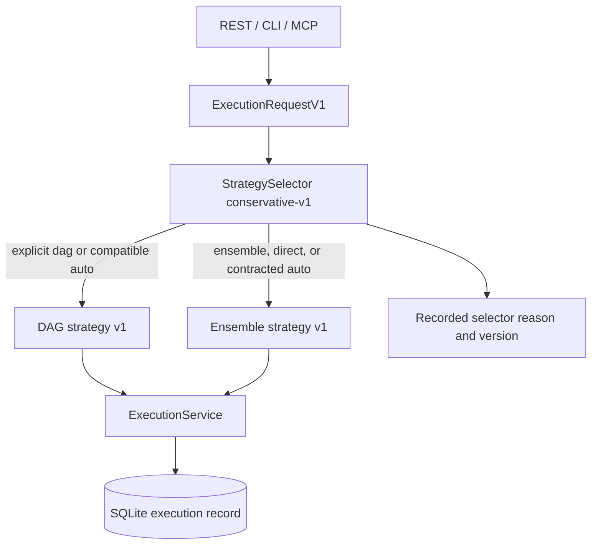
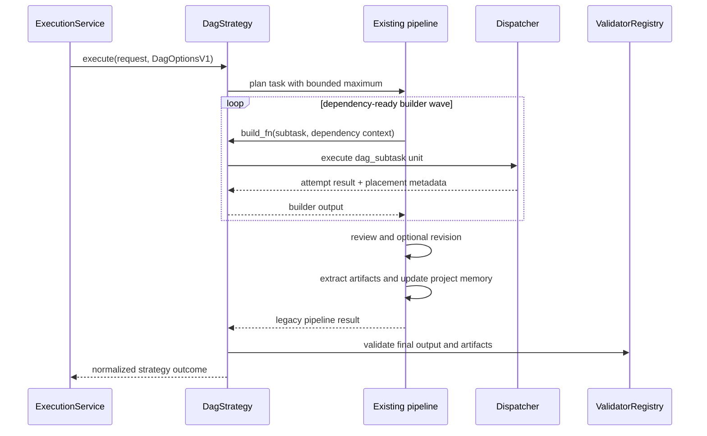
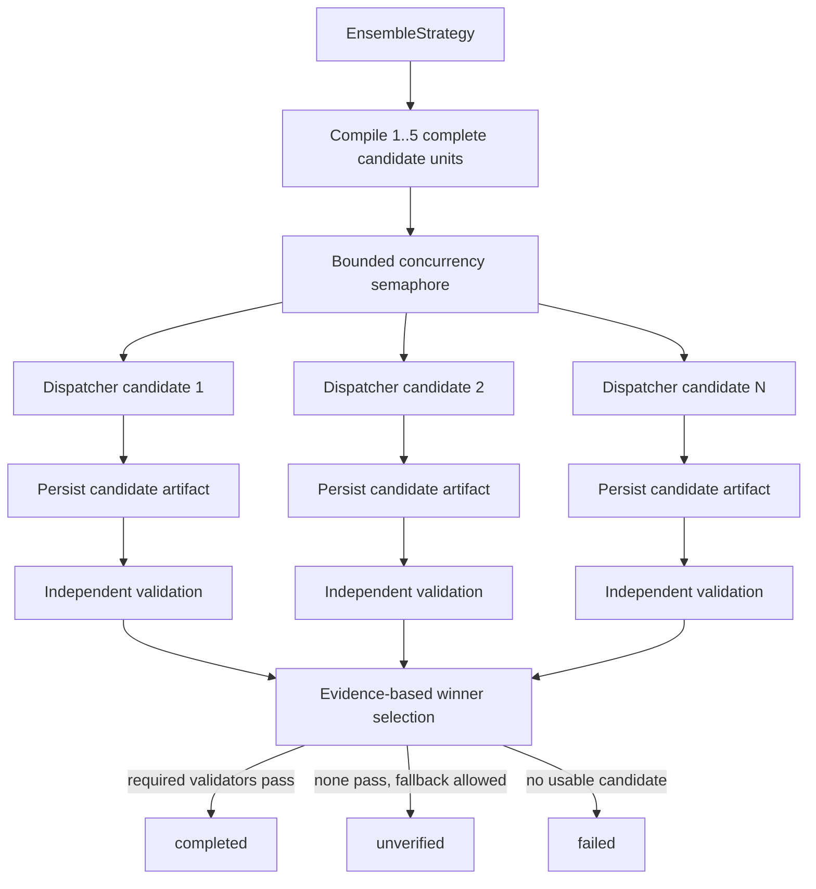
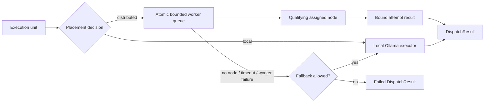
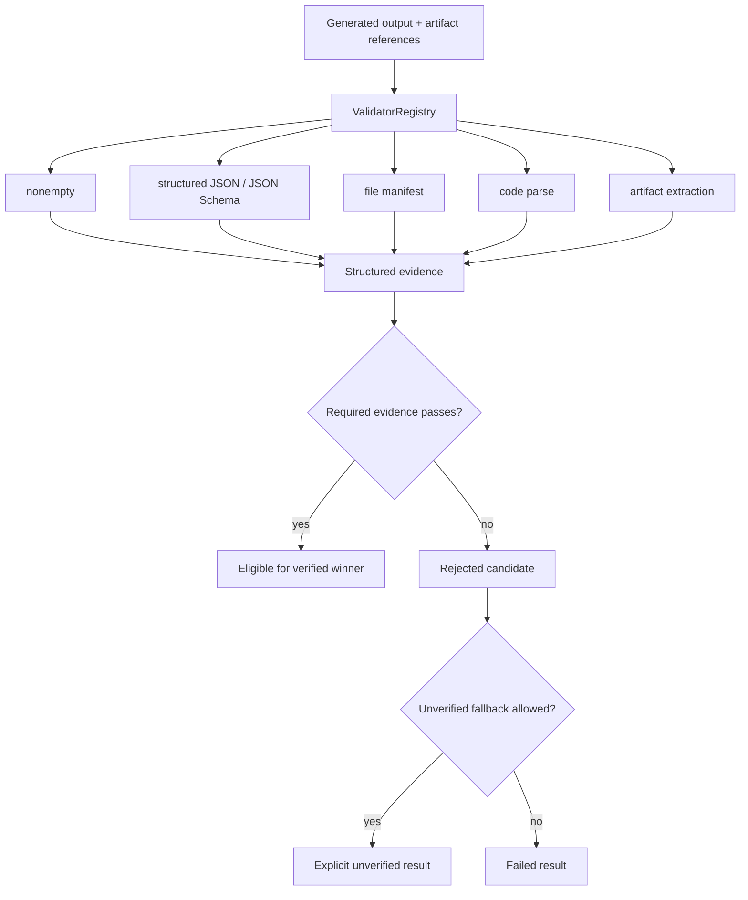
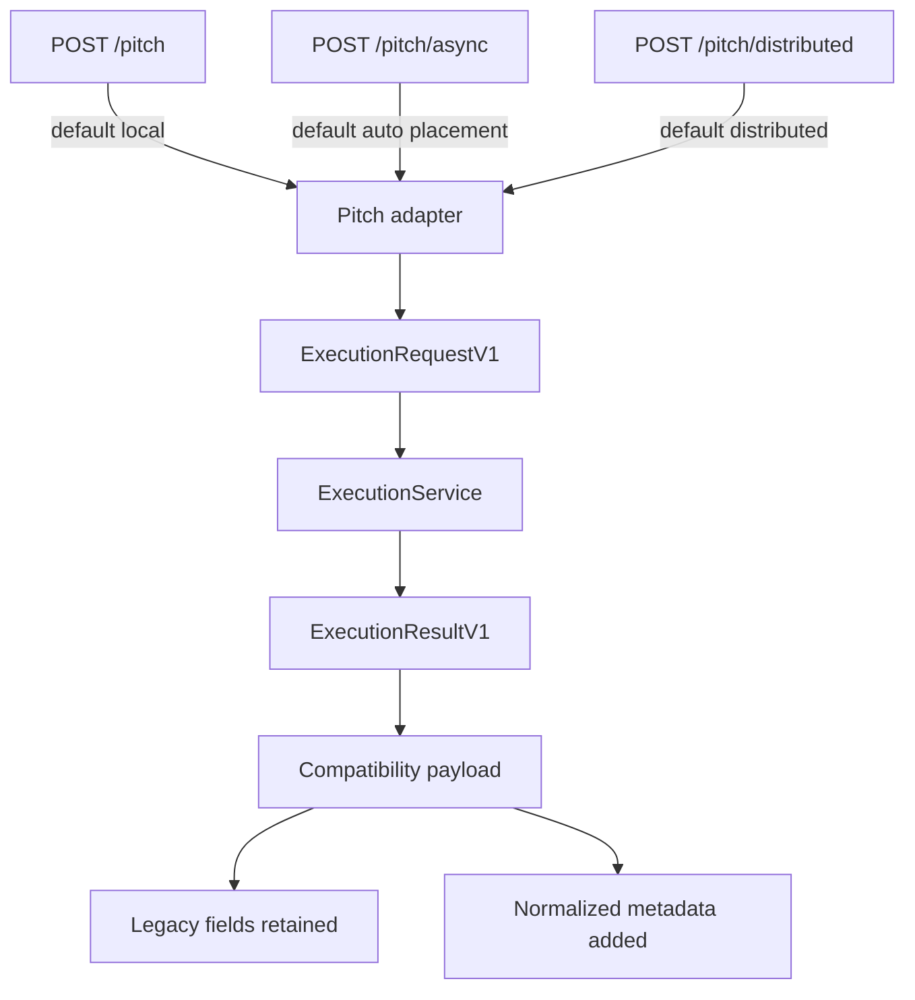
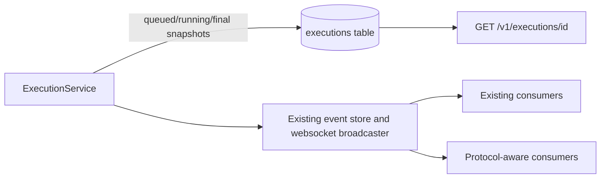

# Execution Architecture

Mycelium separates four decisions that the old pitch route combined: request
validation, strategy selection, placement, and output validation. REST, CLI,
MCP, and compatibility endpoints all enter the same service.

## Request and strategy selection

`direct` has no strategy class. The selector records the request as `direct`
and invokes ensemble with one candidate. Adding a future strategy requires a
contract, registry entry, strategy adapter, validators, and tests; it does not
require new route-specific transport code.

## DAG execution

The adapter preserves the mature pipeline; it does not copy planning, review,
revision, extraction, or memory into an HTTP route.

## Ensemble execution

One failed candidate does not cancel the batch. Distributed candidates carry
the complete task and contract, not a decomposed fragment.

## Placement-independent dispatch

The placement decision filters confidentiality, approved nodes, capabilities,
and blacklist state before the strategy dispatches. Every fallback is attached
to the unit and normalized result.

## Validation and reduction

Strategy generation cannot declare itself correct. The validator registry owns
mechanical evidence; the strategy owns reduction and explanation.

## Legacy endpoint adaptation

`routes_pitch.py` owns authentication, rate limiting, callbacks, legacy job
shape, and response adaptation. It does not own strategy or transport logic.

## Persistence and events

The idempotent migration creates `executions` beside existing `jobs` and
`events`; it does not delete or reinterpret legacy history. Request JSON,
selection, placement, bounded candidate/validation summaries, errors, and the
normalized result are durable. The worker queue, leases, in-flight tasks, and
background coroutines remain process-local.

## Worker trust boundary

Admission still uses one shared node secret. Protocol-v1 assignments add
structural attempt binding: assigned node, task, attempt id, nonce, execution,
unit, and lease expiry must match on token streams and results. This prevents a
different admitted node from settling someone else's active attempt under its
own id, but it does not establish cryptographic node identity. Per-node keys,
revocation, rotation, signed receipts, isolation, and permissionless settlement
remain prerequisites for a less-trusted network.
