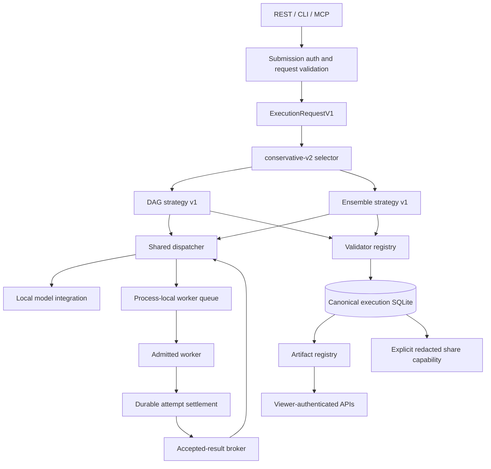
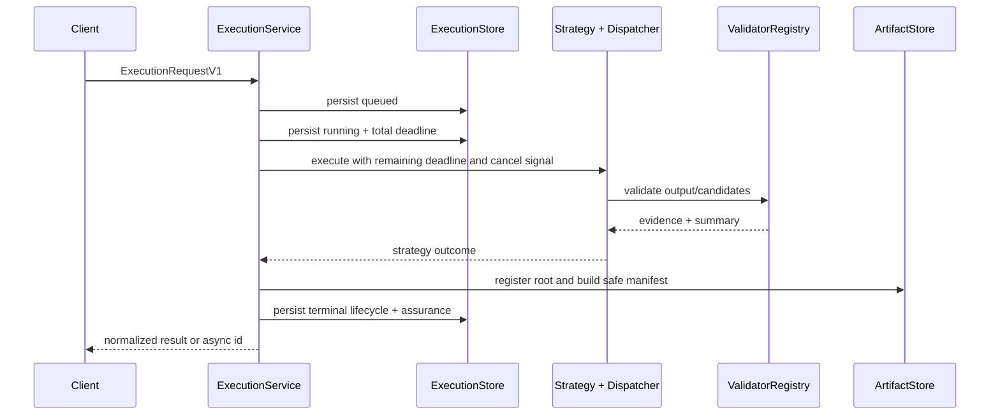
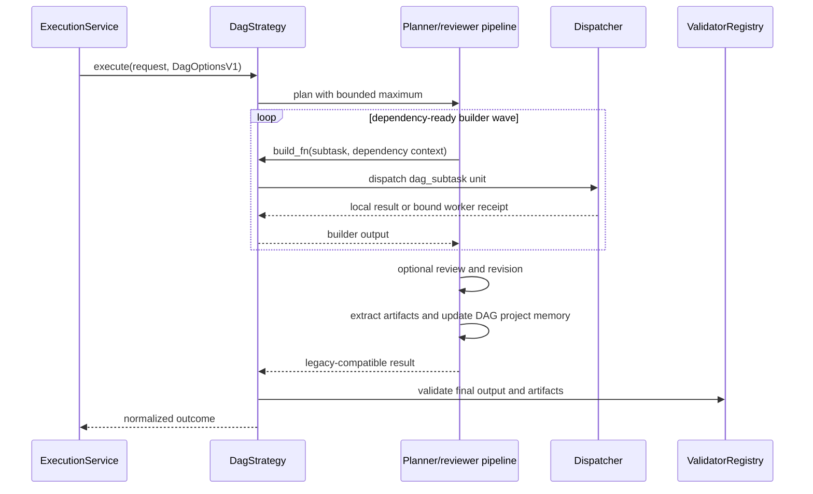
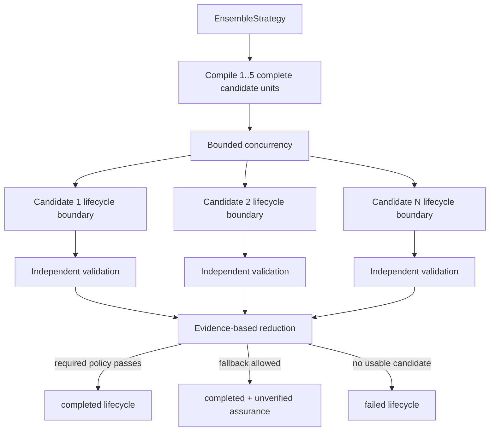
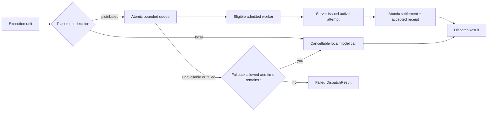
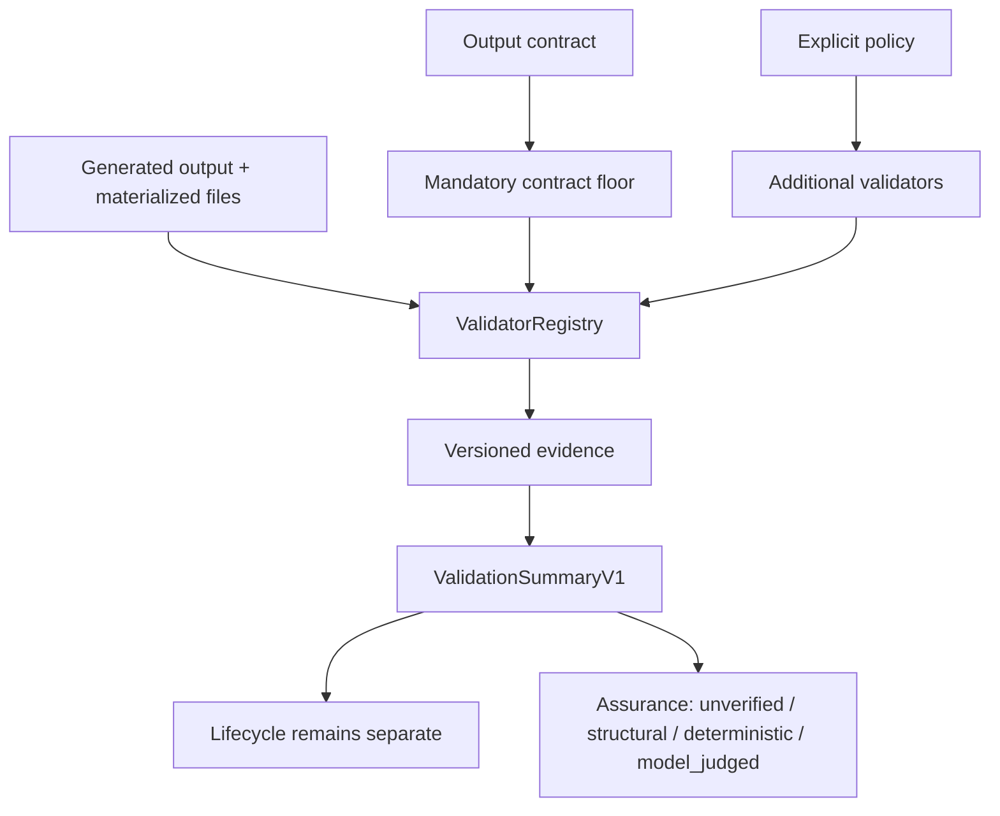
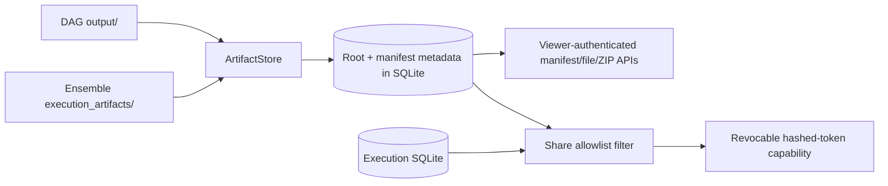
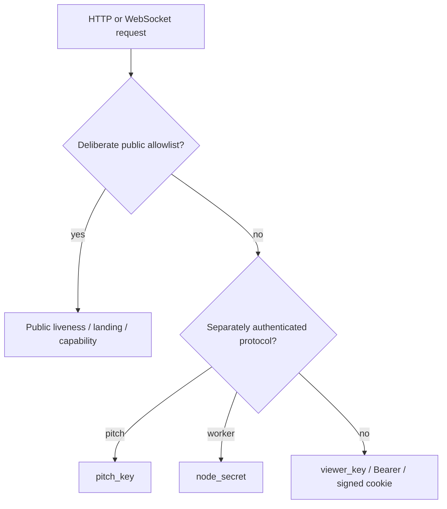

# Trusted-Alpha Execution Architecture

Mycelium separates request policy, orchestration strategy, placement, attempt
authority, validation, artifact delivery, and read access. REST, CLI, MCP, and
legacy adapters converge on the canonical execution service; no route-specific
worker result path may bypass durable attempt settlement.

## System map



`direct` has no strategy class: it is recorded as requested and runs ensemble
with one candidate. `auto` is a deterministic policy. Adding another strategy
would require a contract, registry entry, strategy adapter, validation policy,
persistence coverage, and measured acceptance criteria; no additional strategy
is part of the trusted-alpha sprint.

## Canonical control flow



The total deadline starts at queueing, not at the first worker poll. Each stage
receives only the remaining budget. The execution service owns terminal-state
projection and persistence; strategies cannot turn validation confidence into a
lifecycle state.

## DAG execution



Planning, review, and revision are coordinator work. Builder units may be local
or distributed. The existing pipeline remains an adapter behind the canonical
service rather than being copied into routes.

## Ensemble execution



Generation, candidate directory creation, materialization, extraction, and
validation are inside each candidate's error boundary. `validated_score` orders
accepted candidates by assurance, validator score, lower latency, and stable id.
`first_valid` uses completion order. Neither policy uses output length as a
quality signal.

Project memory is intentionally rejected for ensemble/direct until a
selected-result-only update design exists. DAG remains the supported project
path.

## Placement-independent dispatch



Strategy and placement are orthogonal: complete ensemble candidates as well as
DAG builder units may run on workers. `local_only` prohibits worker dispatch.
Capabilities, approved-node allowlists, and breaker state filter eligibility.
Canonical remote-capable requests require a recorded consent bit.

Results distinguish placement requested, planned, and observed. Unit counts,
fallback count, attempt count, reassignments, and retries prevent a mixed or
reclaimed run from being summarized as one clean remote attempt.

## Attempt authority and accepted-result broker

```mermaid
sequenceDiagram
    participant D as Dispatcher
    participant Q as Process-local queue
    participant W as Worker
    participant A as AttemptStore SQLite
    participant B as AcceptedResultBroker
    D->>Q: queue bound execution unit
    W->>Q: poll as admitted node
    Q->>A: insert active attempt before handout
    Q-->>W: task + attempt id + nonce + lease + bindings
    W->>A: submit echoed binding fields and output
    A->>A: BEGIN IMMEDIATE; validate; active→settled
    A->>A: insert receipt + unique compute contribution
    A-->>B: publish immutable accepted receipt
    B-->>D: receipt matching execution/unit/kind/version
```

The SQLite attempt row is authoritative. The worker cannot select legacy
validation by omitting its contract version or binding fields. Only an active,
unexpired, matching attempt can settle. Raw nonces are never persisted; their
SHA-256 digests are.

Exact replay returns the durable response after restart. Changed replay and
inactive or mismatched attempts are rejected. Rejected output may enter the
bounded quarantine, which is separate from accepted receipts and cannot satisfy
a dispatcher wait, update normal success statistics, or earn points.

The in-memory `task_results` map is a compatibility mirror populated after
settlement. It is not authority.

## Validation and assurance



Contract floors always use AND semantics and cannot be weakened by explicit
validators. `require_all` affects only explicit required validators. Structural
checks report structure; JSON Schema reports deterministic contract
conformance. Current validators do not prove general behavioral correctness.

See [ADR 0004](adr/0004-lifecycle-vs-assurance.md) for why lifecycle and
assurance are separate.

## Artifact and sharing boundary



Artifact roots are internal and must be strict children of the configured
storage bases. Public models expose normalized relative paths, media type,
size, SHA-256, source metadata, and timestamps. Every scan and open rechecks
confinement and symlinks. ZIPs are prepared as bounded temporary files and then
streamed.

A viewer may create an explicit share. The public response is rebuilt through
an allowlist rather than by subtracting sensitive keys. Token hashes, expiry,
revocation, node redaction, candidate detail, and artifact permission are
durable. A share capability grants access only to its redacted execution and,
when enabled, its filtered artifact set.

## Access boundary



Viewer, pitch, and worker credentials are separate authorities. When
`viewer_key` is configured, all routes are private unless method and path are
deliberately allowlisted. When it is empty, middleware fails open for local
compatibility and both startup and `/health` report the exposure. Full matrices
and cookie behavior are in [ACCESS_CONTROL.md](ACCESS_CONTROL.md).

## Persistence and restart boundaries

| State | Durable | Restart behavior |
| --- | --- | --- |
| Canonical execution snapshots | Yes, SQLite | nonterminal rows become retryable `interrupted` |
| Legacy jobs | Yes, SQLite | queued/running rows become retryable `interrupted` |
| Attempt state and exact replay | Yes, SQLite | active rows become `interrupted`; settled replay remains |
| Accepted receipts | Yes, SQLite | broker can reload a matching receipt |
| Contribution records | Yes, SQLite | unique attempt contribution remains exactly once |
| Share records and token hashes | Yes, SQLite | expiry/revocation remain effective |
| Artifact root and manifest metadata | Yes, SQLite plus disk | files remain until retention/pruning |
| Worker queue and in-flight coroutine | **No** | lost; never represented as still running |
| Connected nodes and breaker state | **No** | workers re-register; operational state resets |

Reconciliation makes non-resumable loss truthful; it is not durable scheduling
or failover. The coordinator remains a single point of availability.

## Public pitch admission

The optional keyless endpoint bypasses viewer access only for submission and
returns a one-hour share capability. It rejects all caller execution knobs and
uses one local direct candidate, one global local-inference slot, a two-minute
deadline, a 64 KiB output cap, per-source active/rate limits, and a global
active-job cap. It cannot dispatch to contributor nodes or mutate project
memory.

## Trust boundary

Node admission remains one shared `node_secret`; pitch submission may use one
shared `pitch_key`; viewers may use one shared `viewer_key`. Constant-time
comparisons and attempt binding reduce specific attacks but do not create
identity, individual revocation, TLS, multi-user authorization, Sybil
resistance, or sandboxing. The intended deployment is a small private group of
known operators. See [THREAT_MODEL.md](THREAT_MODEL.md).
