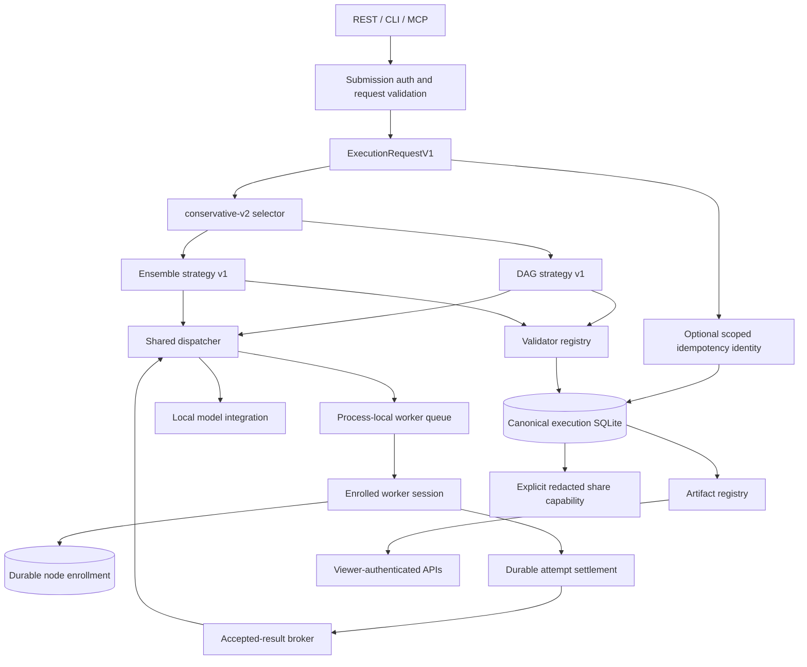
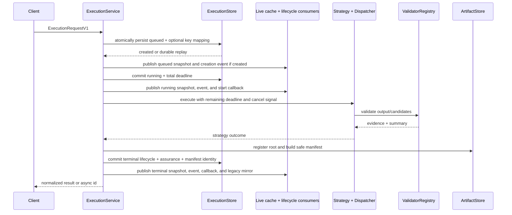
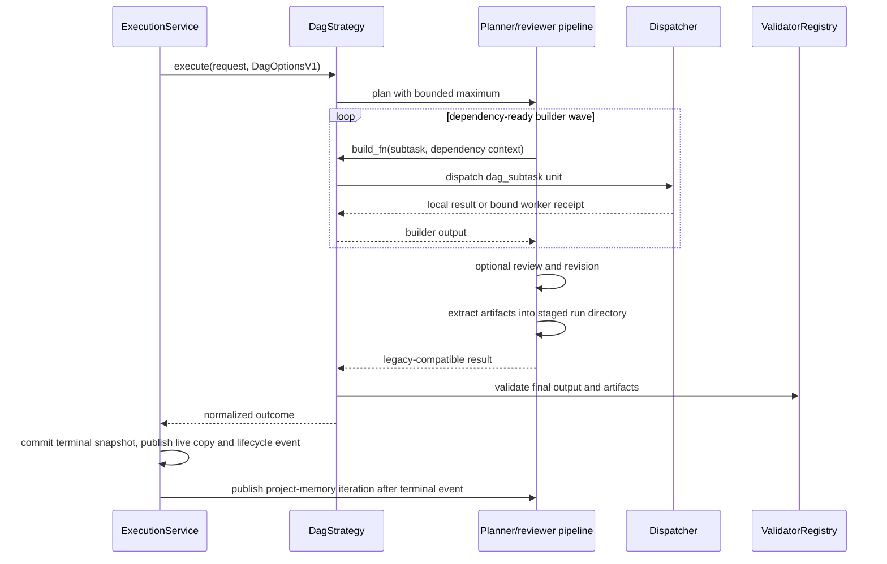
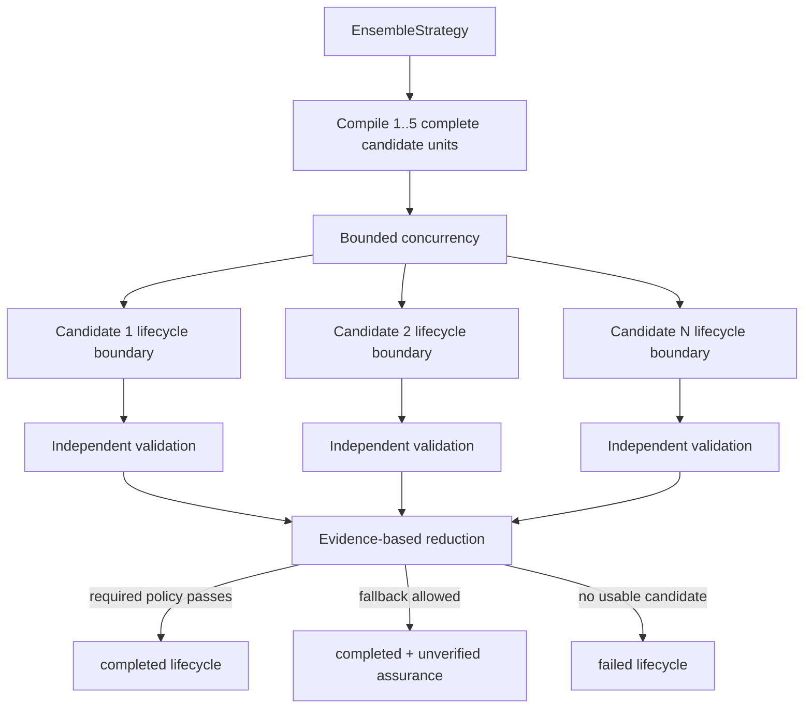
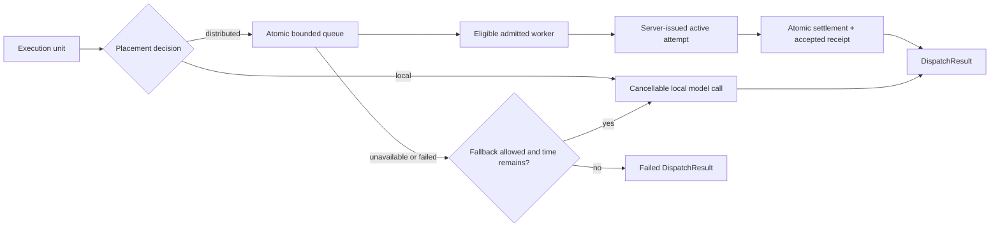
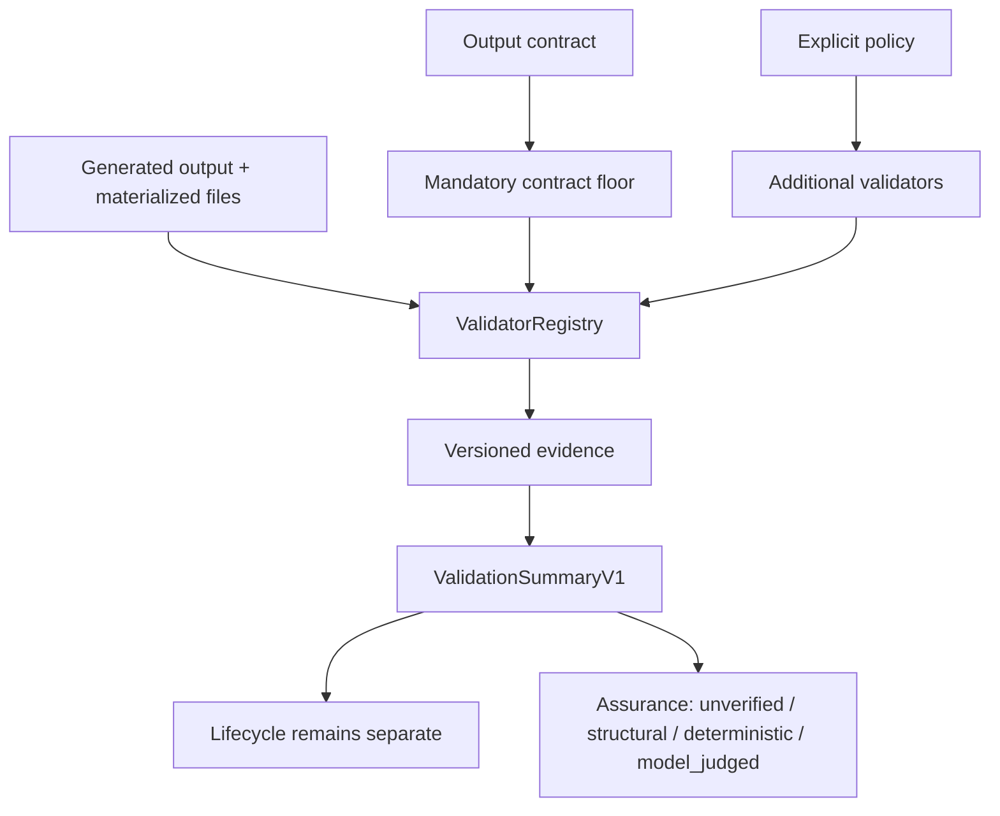
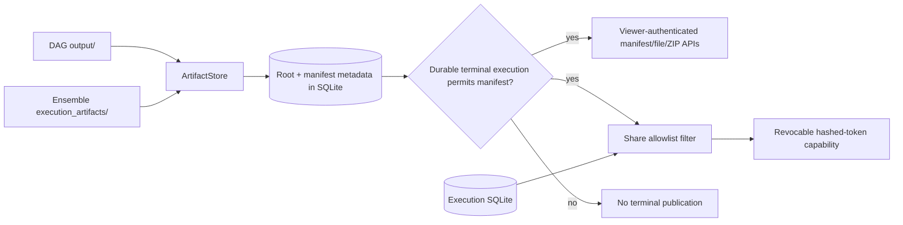
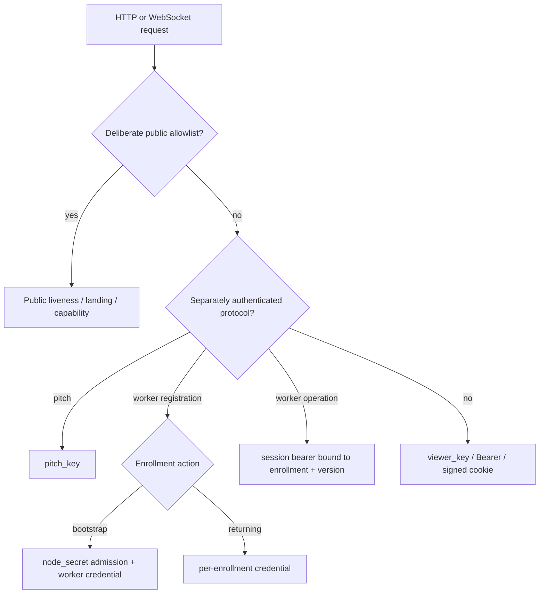

# Trusted-Alpha Execution Architecture

Mycelium separates request policy, orchestration strategy, placement, attempt
authority, validation, artifact delivery, and read access. REST, CLI, MCP, and
legacy adapters converge on the canonical execution service; no route-specific
worker result path may bypass durable attempt settlement.

## System map



`direct` has no strategy class: it is recorded as requested and runs ensemble
with one candidate. `auto` is a deterministic policy. Adding another strategy
would require a contract, registry entry, strategy adapter, validation policy,
persistence coverage, and measured acceptance criteria; no additional strategy
is part of the trusted-alpha sprint.

## Canonical control flow



The total deadline starts at queueing, not at the first worker poll. Each stage
receives only the remaining budget. The execution service owns terminal-state
projection and persistence; strategies cannot turn validation confidence into a
lifecycle state. Every authoritative snapshot is committed before its deep live
copy, normal lifecycle event, callback, compatibility mirror, response, or
terminal artifact/share publication. Diagnostic publication failure is not a
lifecycle transition. See [ADR 0009](adr/0009-durable-terminal-commit-before-publication.md).

## Idempotent canonical submission

Only canonical HTTP submission currently accepts `Idempotency-Key`. After
authentication, rate limiting, and canonical validation, the endpoint computes
three digests: the explicitly versioned canonical request, the key, and its
requester scope. Pre-capability requests retain serializer version 1; an
effective typed resource constraint selects version 2, and the durable mapping
records which serializer replay must use. Configured `pitch_key` material
defines the authenticated
scope; open development mode uses the direct ASGI peer host as a best-effort
scope and does not trust forwarding headers.

An immediate SQLite transaction either creates the initial queued execution
and mapping together, returns the existing execution for a matching replay, or
reports a conflict for a different request. Process-local controls and work are
created only for the committed create outcome. Replaying a queued, running, or
terminal execution never schedules it again.

Idempotency preserves one execution identity; it does not resume process-local
work. A queued commit whose scheduler task is lost at restart becomes
`interrupted`, and the same key continues to return that execution. See
[ADR 0008](adr/0008-idempotent-canonical-execution-submission.md).

## Contributor enrollment and incarnation

Worker trust uses four deliberately separate identifiers. `enrollment_id` is
the immutable durable identity of one invited contributor; `node_id` is its
human-readable label; `session_id` identifies one live worker process; and
`attempt_id` authorizes one lease. The deployment-wide `node_secret` is used
only to admit an initial bootstrap. A returning worker proves its per-node
enrollment credential and receives a new process-local session without the
shared secret.

The coordinator stores a domain-separated digest of each enrollment credential
and no plaintext. Sessions retain only their own token digest plus the
enrollment, label, and credential-version binding. Every authenticated worker
operation checks durable active status. Revocation or rotation therefore
invalidates live use without making sessions durable. Restart drops all
sessions and active scheduling state but preserves enrollment identity and
historical attribution. See
[ADR 0010](adr/0010-durable-enrollment-identity.md).

## Capability claims and hard eligibility

Each enrolled worker session may bind one strict versioned capability
descriptor. It describes the node's claimed executor, models, hardware,
features, limits, and isolation. Canonical JSON and its SHA-256 digest are
stored as an immutable enrollment-scoped snapshot; changing a claim requires a
new session. Values populated by stock-worker detection or operator overrides
remain self-reported claims, not observed evidence or attestation. The digest
identifies the claim; it does not prove the claimed hardware or model bytes.

Canonical requests may carry bounded typed resource requirements in addition
to legacy required-capability strings. A single pure matcher is used for both
initial node qualification and final task handout. It returns stable exclusion
reasons and the descriptor hash evaluated. Hard constraints exclude ineligible
nodes but never rank eligible ones, and unknown claim values do not satisfy
exact or minimum constraints.

Hard eligibility is the complete production scheduling policy. The optional
sampled-comparison path records bounded output-shape agreement, but agreement is
not correctness or trust and never delays, ranks, or reorders production work.
The circuit breaker remains the only failure-based exclusion mechanism.

Attempt issuance binds the session's descriptor version/hash and the canonical
requirement version/digest before handout. Receipts preserve that binding, so a
later session's descriptor cannot change historical assignment meaning. See
[ADR 0011](adr/0011-node-capabilities-versioned-claims.md).

## Scoped capability evidence and shadow policy

The coordinator records bounded operational observations for accepted worker
attempts. A scope is the exact enrollment, descriptor version/hash, executor
kind/version/protocol, selected model provider/name/digest/variant, task class,
and evidence role (`production` or `sampled_comparison`). Missing or inconsistent
bindings are excluded rather than inferred. A descriptor, selected model, task
class, or role change therefore starts a cold scope instead of inheriting an old
history.

Recorded observations are accepted settlement outcome, non-empty output settled
before the issued lease deadline, coordinator wall time, output byte count and
effective throughput, candidate-local contract-floor outcome when that check ran
to a terminal result, worker-attributable lease expiry or stale-node disconnect,
and paired sampled shape agreement. A timely worker error or empty output is a
deadline failure. Fault attribution uses the server-owned terminal cause. Caller
cancellation, execution deadline, coordinator restart, session replacement,
enrollment reclaim, receipt-binding failure, payload/stream limits, supersession,
and unknown causes are not charged to a worker scope.
Sampled attempts durably bind the exact production attempt they compare.

`capability_evidence_mode` accepts only `off` or `shadow` and defaults to `off`.
Both modes preserve the same production handout. `shadow` evaluates a bounded
counterfactual only after the real attempt is durable and assigned. It freezes
already hard-eligible descriptor/model scopes at assignment time and uses only
that immutable set plus observations recorded no later than the assignment.
Below `capability_evidence_min_samples` (default 5), a scope is
explicitly insufficient rather than bad. Binary aggregates expose counts, rates,
and Wilson intervals; recent latency and throughput use bounded medians. Sampled
agreement is diagnostic output-shape agreement, not semantic correctness, and
is not a shadow preference dimension.

Observations and shadow decisions are append-only in SQLite. Domain-separated
deterministic IDs make exact replay idempotent and conflicting reuse an error.
Evidence recording is contained by a savepoint or best-effort boundary: its
failure cannot reverse accepted settlement, receipt publication, or contribution
credit. Missing-only attempt reconciliation and append-only contract-floor
projection receipts provide bounded startup repair without completed rows
starving later gaps. Deadline-success semantics use a versioned subject key, so
an upgrade backfills corrected evidence without mutating or double-counting
superseded append-only rows.

Viewer-protected `GET /v1/operator/capability-evidence` returns aggregates and
shadow decision counts, never raw observations. Evidence rows contain no prompt,
output body, worker error text, free-form reason, credential, nonce, session
secret, or arbitrary telemetry. Contribution points remain a separate record of
accepted compute; they are not capability evidence, assurance, correctness,
reputation, or routing weight. See
[ADR 0012](adr/0012-observed-capability-evidence-shadow-only.md).

## DAG execution



Planning, review, and revision are coordinator work. Builder units may be local
or distributed. The existing pipeline remains an adapter behind the canonical
service rather than being copied into routes. Project memory is a downstream
compatibility publication: a failed terminal commit leaves the staged run and
project iteration unpublished.

## Ensemble execution



Generation, candidate directory creation, materialization, extraction, and
validation are inside each candidate's error boundary. `validated_score` orders
accepted candidates by assurance, validator score, lower latency, and stable id.
`first_valid` uses completion order. Neither policy uses output length as a
quality signal.

Project memory is intentionally rejected for ensemble/direct until a
selected-result-only update design exists. DAG remains the supported project
path.

## Placement-independent dispatch



Strategy and placement are orthogonal: complete ensemble candidates as well as
DAG builder units may run on workers. `local_only` prohibits worker dispatch.
Typed resource requirements, legacy capability tags, approved-node allowlists,
and breaker state filter eligibility. Typed and legacy constraints are both
hard when both are present and use the same matcher again at task handout.
Canonical remote-capable requests require a recorded consent bit.

Results distinguish placement requested, planned, and observed. Unit counts,
fallback count, attempt count, reassignments, and retries prevent a mixed or
reclaimed run from being summarized as one clean remote attempt.

## Attempt authority and accepted-result broker

```mermaid
sequenceDiagram
    participant D as Dispatcher
    participant Q as Process-local queue
    participant W as Worker
    participant A as AttemptStore SQLite
    participant B as AcceptedResultBroker
    D->>Q: queue bound execution unit
    W->>Q: poll as admitted node
    Q->>A: insert attempt + descriptor/requirement digests before handout
    Q-->>W: task + attempt id + nonce + lease + immutable bindings
    W->>A: submit echoed binding fields and output
    A->>A: BEGIN IMMEDIATE; validate; active→settled
    A->>A: insert receipt + unique compute contribution
    A-->>B: publish immutable accepted receipt
    B-->>D: receipt matching execution/unit/kind/version
```

The SQLite attempt row is authoritative. The worker cannot select legacy
validation by omitting its contract version or binding fields. Only an active,
unexpired, matching attempt can settle. Raw nonces are never persisted; their
SHA-256 digests are.

Exact replay returns the durable response after restart. Changed replay and
inactive or mismatched attempts are rejected. Rejected output may enter the
bounded quarantine, which is separate from accepted receipts and cannot satisfy
a dispatcher wait, update normal success statistics, or earn points.

The in-memory `task_results` map is a compatibility mirror populated after
settlement. It is not authority.

## Validation and assurance



Contract floors always use AND semantics and cannot be weakened by explicit
validators. `require_all` affects only explicit required validators. Structural
checks report structure; JSON Schema reports deterministic contract
conformance. Current validators do not prove general behavioral correctness.

See [ADR 0004](adr/0004-lifecycle-vs-assurance.md) for why lifecycle and
assurance are separate.

## Artifact and sharing boundary



Artifact roots are internal and must be strict children of the configured
storage bases. Public models expose normalized relative paths, media type,
size, SHA-256, source metadata, and timestamps. Every scan and open rechecks
confinement and symlinks. ZIPs are prepared as bounded temporary files and then
streamed.

A viewer may create an explicit share. The public response is rebuilt through
an allowlist rather than by subtracting sensitive keys. Token hashes, expiry,
revocation, node redaction, candidate detail, and artifact permission are
durable. A share capability grants access only to its redacted execution and,
when enabled, its filtered artifact set. A share may exist while an execution
is nonterminal, but its public view can expose only the last committed snapshot
and no terminal artifacts. A sealed manifest may be prepared during
finalization, but artifact access requires the committed terminal execution to
reference that exact baseline. Historical `legacy_live` manifests keep their
documented rescan-based compatibility behavior and are never labeled sealed.

## Access boundary



Viewer, pitch, bootstrap-admission, enrollment, and live-session credentials
are separate authorities. When
`viewer_key` is configured, all routes are private unless method and path are
deliberately allowlisted. When it is empty, middleware fails open for local
compatibility and both startup and `/health` report the exposure. Full matrices
and cookie behavior are in [ACCESS_CONTROL.md](ACCESS_CONTROL.md).

## Persistence and restart boundaries

| State | Durable | Restart behavior |
| --- | --- | --- |
| Canonical execution snapshots | Yes, SQLite | nonterminal rows become retryable `interrupted` |
| Scoped submission mappings | Yes, SQLite | matching retries return the same execution, including `interrupted` |
| Legacy jobs | Yes, SQLite | queued/running rows become retryable `interrupted` |
| Attempt state and exact replay | Yes, SQLite | active rows become `interrupted`; settled replay remains |
| Accepted receipts | Yes, SQLite | broker can reload a matching receipt |
| Node enrollments and credential digests | Yes, SQLite | identity/revocation survive; worker obtains a new session |
| Enrolled capability snapshots | Yes, SQLite | immutable claim JSON and descriptor hashes survive; a fresh session selects its claim |
| Scoped capability observations and shadow decisions | Yes, SQLite | append-only operational aggregates survive; startup performs bounded best-effort reconciliation |
| Contribution records | Yes, SQLite | unique attempt contribution and enrollment attribution remain exactly once |
| Share records and token hashes | Yes, SQLite | expiry/revocation remain effective |
| Artifact root and manifest metadata | Yes, SQLite plus disk | files remain until retention/pruning |
| Worker queue and in-flight coroutine | **No** | lost; never represented as still running |
| Connected nodes, sessions, and breaker state | **No** | enrolled workers authenticate again; operational state resets |

Reconciliation makes non-resumable loss truthful; it is not durable scheduling
or failover. Submission mappings are retained indefinitely during trusted alpha
and are part of backup/restore. The coordinator remains a single point of
availability.

## Public pitch admission

The optional keyless endpoint bypasses viewer access only for submission and
returns a one-hour share capability. It rejects all caller execution knobs and
uses one local direct candidate, one global local-inference slot, a two-minute
deadline, a 64 KiB output cap, per-source active/rate limits, and a global
active-job cap. It cannot dispatch to contributor nodes or mutate project
memory.

## Trust boundary

Initial node admission uses one shared `node_secret`; each enrolled contributor
then has an independently revocable bearer credential. Pitch submission may use
one shared `pitch_key`, and viewers may use one shared `viewer_key`.
Constant-time comparisons and enrollment/session/attempt binding reduce
specific attacks but do not prove physical-machine identity, provide TLS,
multi-user authorization, Sybil resistance, attestation, or sandboxing. The
intended deployment remains a small private group over TLS or a private
authenticated overlay. All pitch-key holders share an idempotency scope;
open-mode peer scoping is development-grade and is not user identity. See
[THREAT_MODEL.md](THREAT_MODEL.md).
